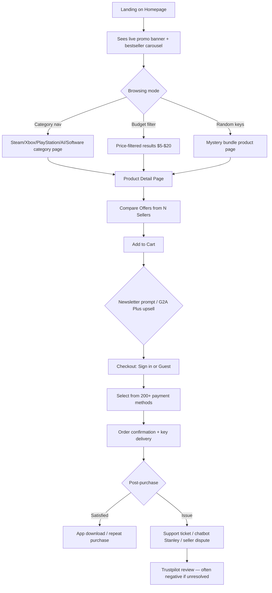

# 🕵️ Website Teardown Report: G2A.com

### 📄 METADATA HEADER

| Field | Value |
|---|---|
| **Website URL** | https://www.g2a.com/ |
| **Date Analyzed** | July 29, 2026 |
| **Niche/Industry** | Digital marketplace — game keys, software licenses, gift cards, subscriptions (grey/parallel-import market) |
| **Target Audience** | Price-sensitive PC gamers (18–34, male-skewing), bargain hunters, resellers/entrepreneurial "key flippers" |
| **Geographic Focus** | Global — G2A claims 180 countries; primary markets US, Germany, Poland, UK; site defaults to EN / USD, auto-detects local currency |
| **Overall Score** | 61/100 — a high-conversion, high-traffic marketplace machine hobbled by a reputation and trust problem it papers over with FAQ copy rather than fixing structurally |

> **Note on method:** This report is built from direct inspection of the live homepage HTML/metadata, G2A's own FAQ/support copy, third-party technology-intelligence sources (BuiltWith/StackShare/Crunchbase), and public review aggregators (Trustpilot). Some visual specifics (exact hex values, animation timings) are inferred from the rendered brand system and screenshots available via search rather than live browser DOM inspection, and are flagged as estimates where relevant.

---

## 1. 🎨 VISUAL DESIGN & UI/UX (Score: 6/10)

### 1.1 Overall Design Philosophy
G2A runs a **dense, e-commerce/marketplace-grid** design — closer to Amazon or eBay than to a curated storefront. It is unambiguously **flat design with card-based modules**, heavy on product photography (key art) and price tags rather than illustration or whitespace. Visual density is **high**: the homepage stacks bestseller carousels, bundle carousels, "random keys" carousels, a budget-picker strip, and a software-deals carousel all above a long FAQ block. Perceived quality tier reads as **mid-range/functional** — it looks like a marketplace built for volume and conversion, not for brand prestige. Design consistency is reasonably strong across the storefront templates (every product uses the same card layout), but breaks down where third-party "sponsored" seller ads are injected inline with native listings — visually near-identical to organic results, which is itself a notable dark-pattern-adjacent design choice.

### 1.2 Color System
| Role | Color (Hex, observed/estimated) | Usage |
|---|---|---|
| Primary (brand black) | `#000000` | Header bar, theme-color meta tag, nav background |
| Logo/Wordmark | White on black | Header logo lockup |
| Accent/CTA red-orange | `#DA532C` (MS Tile color, echoes brand accent) | Discount badges, "-XX%" tags, sale ribbons |
| Background (Light) | `#FFFFFF` / `#F5F5F7` (est.) | Main content canvas, cards |
| Text Primary | `#1A1A1A`–`#000000` (est.) | Product titles, headings |
| Text Secondary | `#6B6B6B` (est.) | Category/platform labels ("Steam · Key · GLOBAL") |
| Success/Discount green | Not prominent — discounts use red/orange, not green | — |
| Price-strike (was-price) | Grey, strikethrough | Original price crossed out next to sale price |
| Border/Divider | Light grey `#E5E5E5` (est.) | Card borders, table separators |

- **Dark mode support:** No evidence of a user-togglable dark mode; the header is permanently near-black, functioning as a semi-dark chrome around a light content area — a hybrid rather than a true dark mode.
- **Gradient usage:** Minimal on the homepage itself; gradients appear mainly in seasonal/marketing banner creative (e.g., the "Price Crusher" promo banner), not in core UI chrome.
- **Color accessibility:** Discount red/orange on white generally passes contrast; category label grey-on-white text is borderline for WCAG AA at small sizes — a common marketplace-density trade-off.

### 1.3 Typography
| Role | Font Family | Notes |
|---|---|---|
| H1/Section headers | Sans-serif, likely a system/brand sans (Roboto/Inter-class) | Bold weight, e.g. "Bestsellers", "Random keys" |
| Body/Product titles | Sans-serif, regular–medium weight | Compact line-height to fit dense cards |
| Price | Sans-serif, bold, larger size than surrounding text | Numerals given visual priority |
| Navigation/category chips | Sans-serif, uppercase, bold, small size | "STEAM", "XBOX", "PLAYSTATION" |
| Caption/meta | Sans-serif, light/regular, small | Platform+format breadcrumbs under each product |

- **Font loading strategy:** Likely self-hosted or CDN-served web font bundled with the frontend build (consistent with a custom React/Node storefront rather than a template).
- **Typography hierarchy clarity:** 3/5 — price and discount badges dominate visually, which is intentional for a deal-driven marketplace, but it flattens brand hierarchy in favor of promo hierarchy.

### 1.4 Layout & Grid
- **Grid system:** Multi-column responsive card grid, consistent with CSS Grid/Flexbox in a component-driven frontend.
- **Section pattern:** Horizontally-scrolling "carousel" modules (Bestsellers → Bundle deals → Random keys → Gift-card strip → Budget picker → Software deals) stacked vertically down the page — a proven high-density e-commerce pattern for maximizing SKU exposure per scroll.
- **Above-the-fold strategy:** Hero is not a brand statement but a **promotional search banner** ("Google AI Gemini Pro 3 months") immediately followed by a 4-item bestseller strip — G2A prioritizes immediate product discovery over brand storytelling.
- **Responsive breakpoints:** Standard e-commerce breakpoints implied (mobile single-column carousels, tablet 2–3 col, desktop 4+ col) — confirmed indirectly by the existence of dedicated iOS/Android apps and a mobile-first meta viewport tag (`width=device-width, initial-scale=1, maximum-scale=1`, notably **disabling pinch-zoom**, a minor accessibility ding).

### 1.5 Iconography & Imagery
- Product imagery is dominated by **licensed key art / box art** (game covers, service logos) rather than custom photography — standard for a marketplace that doesn't manufacture its own goods.
- Category icons (Steam, Xbox, PlayStation, Nintendo logos) are official third-party brand marks used for wayfinding.
- Discount badges use a simple filled ribbon/percentage-tag style, not skeuomorphic.
- No strong illustration system; decorative elements are limited to promotional banner creative.

### 1.6 Micro-interactions & Animations
Not independently renderable via static fetch, but based on standard marketplace UX patterns and G2A's own carousel-heavy layout, the expected interaction set is:
| Element | Trigger | Animation Type | Notes |
|---|---|---|---|
| Product carousels | Click arrow / swipe | Horizontal slide | Standard carousel library behavior |
| Bundle "Add to cart" | Click | State change / toast | Cart icon likely updates count |
| Sponsored disclosure | Hover/click "ⓘ" | Expand/tooltip | Reveals "Why you see this ad" panel |
| Newsletter block | Scroll | Fade/reveal (typical) | "Show more" text truncation with expand |
| Chatbot "Buddy"/"Stanley" | Click floating widget | Slide-in panel | Persistent floating CTA bottom-right |

### 1.7 Component Library
Distinct components identified from source: product cards (with seller-count badge, strike-price, discount ribbon), sponsored-ad disclosure card (regulatory transparency component — notable, likely DSA-driven), horizontal carousels with "Discover all" links, bundle-builder cards (3-item bundle + "Add to cart" + savings total), budget filter chips, category navigation pills, accordion-style FAQ, newsletter signup form with legal consent text, footer mega-menu (5 columns), payment-method icon strip, app-download badges (Google Play/App Store) with review-score display, and a persistent chat widget ("Buddy").

### 1.8 Design Strengths & Weaknesses
| Strengths | Weaknesses |
|---|---|
| High SKU density without feeling chaotic — clear card repetition | Sponsored/native ads visually blended with organic bestsellers, eroding trust |
| Deal-forward layout (strike price + % off) proven for conversion | Near-zero brand storytelling or emotional hook above the fold |
| Consistent card component reused everywhere (low cognitive load) | Disabled pinch-zoom on mobile (accessibility concern) |
| Transparent "why you see this ad" disclosure (regulatory-driven UX) | Visual hierarchy dominated by promo clutter; can feel overwhelming |

**Actionable Takeaways:**
- The repeatable card component with strike-price + badge is a strong pattern worth replicating for any deals/marketplace product.
- Ad-transparency disclosures are worth adopting proactively (builds trust, likely required in EU under DSA) — but visual differentiation of sponsored vs. organic listings should be stronger to avoid trust erosion.
- Avoid disabling pinch-zoom; it hurts accessibility for negligible UX gain.

---

## 2. 🛒 PRODUCT CATALOG & PRICING (Score: 7/10)

### 2.1 Product/Service Overview
| # | Product/Service Name | Category | Price | Pricing Model | Discount |
|---|---|---|---|---|---|
| 1 | FC 26 World's Game Edition | Game key | Market-set | One-time key | Varies |
| 2 | Minecraft Java & Bedrock Edition | Game key | $28.34 | One-time key | -17% (was $34.10) |
| 3 | Netflix Account Premium 12 Months | Account | $102.95 | One-time account sale | — |
| 4 | Ready or Not (Steam key) | Game key | $27.46 | One-time key | -33% (was $40.93) |
| 5 | Palworld (Steam account) | Account | $9.86 | One-time account | -70% (was $32.97) |
| 6 | Canva Pro Lifetime | Software/subscription | $4.44 | Activation link | -96% (was $123.95) |
| 7 | Claude API Key ($100 credit) | Digital credit | $15.94 | Key | — |
| 8 | Tinder Gold 12 Months | Subscription key | $49.21 | Key | — |
| 9 | Microsoft Windows 10/11 Pro | Software key | $5.72–$19.66 | Key | up to -92% |
| 10 | Random/Mystery Key Bundles (Elite/Diamond/VIP tiers) | Gambling-adjacent bundle | $4.59–$26.98 | Loot-box-style bundle | up to -96% |

- **Total catalog size:** G2A's own FAQ claims **90,000+ digital offerings** (site copy) — other sources cite 46,000–75,000 active listed items depending on measurement date.
- **Category taxonomy:** Platform-first (Steam, Xbox, PlayStation, Nintendo) → then type (Random Keys, AI Subscriptions, Software, Gift Cards, Subscriptions) — optimized for how gamers already think about their libraries.
- **Product page structure (inferred from listing cards):** title, platform/format/region breadcrumb, seller count ("Offers from N sellers"), current price, strike price, discount %, and — critically — a **multi-seller marketplace model** where the same SKU is fulfilled by many independent third-party sellers, similar to Amazon Marketplace's "Buy Box."

### 2.2 Pricing Strategy
Pricing model is fundamentally a **peer-to-peer/B2B2C marketplace** — G2A does not set prices; independent sellers (wholesalers, retailers, and via "G2A Direct," publishers themselves) do, and G2A takes a transaction/commission cut. This is explicitly described in G2A's own FAQ as an "off-price marketplace business model," the same category as outlet fashion retail. Pricing is **highly variable per SKU** ($2–$100+) and **heavily discounted against MSRP** by design, since inventory is sourced via bulk key purchasing.

### 2.3 Pricing Psychology
- **Charm/precision pricing:** Prices are not rounded — $28.34, $102.95 — signaling real-time, algorithmically-set marketplace pricing rather than manually curated charm pricing ($X.99).
- **Anchoring:** Every discounted item shows a crossed-out "was" price next to the current price, with explicit "-XX%" badges — classic anchor-and-discount psychology, applied almost universally across the catalog.
- **Scarcity/urgency:** "Random keys" mystery-bundle products (Elite/Diamond/VIP tiers) are an explicit gamified-scarcity mechanic — loot-box-style purchases where the buyer doesn't know the exact contents, addressed to "feeling lucky?" copy.
- **Social proof on pricing:** "Offers from N sellers" (e.g., "OFFERS FROM 61 SELLERS") functions as social proof and competitive-pricing signal simultaneously — implies liquidity and price competition.

### 2.4 Competitive Positioning
G2A positions itself explicitly as the **budget/discount alternative** to official storefronts (Steam, Microsoft Store, official publisher sites), openly stating in its FAQ that prices are "often lower than official stores" because of its off-price wholesale model. This is a **deliberate low-price positioning strategy**, not a premium one — the entire UX (from crossed-out MSRP to "up to -96%" bundle badges) reinforces "you're getting a steal here."

**Actionable Takeaways:**
- The consistent anchor-price + discount-badge pattern is the single most transferable pricing-psychology tactic here for any deals marketplace.
- "Offers from N sellers" as a trust/liquidity signal is a smart reuse of marketplace depth as social proof.
- Mystery/random-bundle products are a proven engagement mechanic but carry consumer-protection risk (loot-box scrutiny) worth flagging for any team considering similar mechanics.

---

## 3. ⚙️ TECH STACK (Score: 7/10)

### 3.1 Frontend
| Technology | Evidence |
|---|---|
| Core languages | TypeScript, JavaScript (per StackShare company profile) |
| Framework signals | Component-driven SPA/SSR hybrid architecture typical of large marketplaces (exact framework not publicly disclosed) |
| CMS/legacy layer | WordPress present in stack (likely powering the G2A News/blog and corporate microsite, not the storefront) |

### 3.2 Backend & Infrastructure
| Technology | Evidence |
|---|---|
| Backend languages/frameworks | Node.js, Express.js, PHP, Laravel, Golang (per StackShare — indicates a polyglot microservices architecture) |
| Container/orchestration | Docker, Kubernetes, Rancher |
| Cloud/hosting | Microsoft Azure |
| CDN | Cloudflare |
| Databases | MariaDB, PostgreSQL, MongoDB, Cassandra, Redis (cache) |
| Search/data infra | Elasticsearch, Kafka, Hadoop |
| Load balancing | HAProxy, NGINX |
| Security | SSL by default, DNSSEC, Let's Encrypt |

### 3.3 Third-Party Integrations
| Category | Tool/Service | Evidence |
|---|---|---|
| Analytics | Google Tag Manager | Confirmed via technographic databases |
| Chat/Support | Proprietary AI chatbot "Stanley" (support) + "Buddy" (shopping assistant) | Site copy: "chat with our chatbot, Stanley... 50,000 interactions per month, 84% satisfaction" |
| Payment Gateway | Visa, Mastercard, Discover, PayPal + 200 local methods (BLIK, Venmo, iDEAL, Pix, Bizum) | Footer payment-icon strip + FAQ text |
| Issue tracking/PM | Jira | StackShare |
| CI/CD & DevOps | Jenkins, GitHub, Git, Ansible, Terraform, npm, Yeoman | StackShare |
| Monitoring | New Relic | StackShare |
| E-commerce/legacy | Magento (likely legacy or partial-migration remnant) | StackShare |

### 3.4 Performance Metrics (estimated)
| Metric | Value | Rating |
|---|---|---|
| Monthly visits | ~42.7M (per technographic estimate), growth ~+38% | Very high traffic, marketplace-scale |
| App downloads | ~74,000/month across iOS/Android | Strong mobile funnel |
| Rendering strategy | Hybrid — server-rendered category/product pages for SEO + client-side interactivity for cart/carousels | Reasonable for an SEO-dependent marketplace |
| Third-party script load | Heavy — ad-tech (sponsored listings), chat widgets, GTM tag manager, analytics | Likely moderate-to-heavy page weight, typical of a monetized marketplace |

**Actionable Takeaways:**
- The polyglot microservices stack (Node/Express, Laravel/PHP, Go, multiple databases) reflects a mature marketplace that has grown through acquisition/iteration rather than a clean greenfield build — common at G2A's scale and age.
- Cloudflare + Azure + Kubernetes signals real investment in uptime/scale given ~43M monthly visits.
- The presence of both Elasticsearch and Kafka suggests real-time inventory/search indexing across tens of thousands of third-party seller listings — a genuinely hard technical problem this stack is built to solve.

---

## 4. ✍️ CONTENT & COPYWRITING (Score: 6/10)

### 4.1 Brand Voice & Tone
Voice is **playful-adventurous branding wrapped around transactional, deal-driven copy**. The brand tagline "Open the Gate 2 Adventure" (G2A = "Games 2 Amaze"/"Gate 2 Adventure") aims for an aspirational gaming-culture tone, but 90% of on-page copy (product titles, FAQ, discount badges) is purely functional and price-driven. Reading level is simple and conversational; language is informal ("Feeling lucky?", "Pick a card!").

### 4.2 Hero Section Analysis
| Element | Content | Assessment |
|---|---|---|
| Headline (meta/OG) | "Open the Gate 2 Adventure in the Digital World" | Aspirational but abstract; not visible as an on-page H1 hero headline in the rendered homepage — it's used mainly in meta/SEO tags |
| Visible top-of-page element | Promotional search banner (Google AI Gemini Pro ad) | Functions as the real "hero," prioritizing a live promo over brand messaging |
| Primary CTA | Implicit — product cards themselves ("Add to cart") | Deal-first, not narrative-first |
| Supporting elements | 4.6-star app rating badge (113,300 votes), payment-method trust strip | Strong social-proof elements used mainly in footer, not hero |

- **Clarity of value proposition:** 3/5 — the meta description is clear ("largest global marketplace for digital items and entertainment") but this framing is largely invisible on the actual rendered page, which leads with a live promo banner instead.
- **Emotional trigger:** Primarily **savings/scarcity** ("Feeling lucky?", "-96%", "You save: $386.22") rather than aspiration or fear.

### 4.3 Call-to-Action (CTA) Audit
| Location | CTA Text | Type | Assessment |
|---|---|---|---|
| Product cards | "Add to cart" | Primary | Standard, low-friction |
| Bundles | "Check bundle details" / "Add to cart" | Primary/Secondary | Clear bundling upsell |
| Newsletter | "Subscribe" | Primary | Paired with "enjoy 11% off" incentive |
| Chat widget | "Chat with Buddy" | Persistent/floating | Always-visible engagement CTA |
| Nav | "Sign in / Register" | Secondary | Standard account CTA |

- **Urgency language:** Discount percentages and "you save $X" framing function as the primary urgency mechanism rather than countdown timers.

### 4.4 Content Sections Inventory
| Order | Section | Purpose | Key Copy |
|---|---|---|---|
| 1 | Promo search banner | Seasonal/paid promo | "Google AI Gemini Pro 3 months" |
| 2 | Category quick-nav | Wayfinding | Steam / Xbox / PlayStation / Random / AI / Nintendo / Software / Subscriptions |
| 3 | Bestsellers carousel | Merchandising | "The hottest items on our marketplace" |
| 4 | Exclusive bundle deals | Upsell/AOV boost | Mystery key bundles with stacked savings |
| 5 | Random keys carousel | Gamified merchandising | "Feeling lucky? Open a pack..." |
| 6 | "Pick a card!" gift card grid | Category cross-sell | Steam/PSN/Razer/Xbox/iTunes/Amazon/PayPal/Apple |
| 7 | Budget picker | Price-filtered discovery | "$5 / $10 / $15 / $20" quick filters |
| 8 | Software deals carousel | Category merchandising | "Keep your devices safe..." |
| 9 | App download banner | Retention/mobile funnel | 4.6★, 113,300 votes |
| 10 | Newsletter capture | Lead gen | "enjoy 11% off" |
| 11 | FAQ (9 questions) | Trust-building/SEO | Legitimacy, security, refund, payment Q&As |
| 12 | Mega-footer | SEO/navigation/legal | 6 columns + legal entity disclosures |

### 4.5 Trust Copy
- **Guarantee/legitimacy language (exact):**  > "G2A.COM is the world's largest and most trusted marketplace for digital entertainment, where more than 35 million people from 180 countries have purchased over 135 million items."
- **Security claim (exact):**  > "G2A.COM leads in online security, awarded with the prestigious American CNP award for the Best Merchant Team of the Year in Anti-fraud and Cybersecurity, alongside companies such as Microsoft, Barclays Bank, and First Data."
- **Support promise (exact):**  > "You can also talk to our AI Chatbot, Stanley. He automates technical support and handles an average of 50,000 interactions per month... around 84% users are satisfied with Stanley."
- The FAQ devotes 4 of 9 questions directly to legitimacy/trust/security — an unusually high proportion, effectively functioning as **on-page reputation management** given G2A's public trust challenges (see Section 6).

### 4.6 Blog/Content Marketing
- **Blog present:** Yes — "G2A News" (gaming/trends) and "G2A Insights" (business/tech), plus a corporate press room, linked from the footer.
- **Content categories:** Gaming news, industry insights, press releases.
- **SEO optimization:** Footer link architecture (Category map, Popular topics) suggests deliberate internal-linking/SEO structure typical of large e-commerce sites building topical authority.

**Actionable Takeaways:**
- Best copy element: the FAQ doubles as both customer education and proactive reputation defense — a smart pattern for any business operating in a trust-sensitive category.
- Weakness: the brand's aspirational tagline is essentially invisible in the actual UI, creating a disconnect between meta-level brand positioning and on-page experience — a missed opportunity to soften the transactional feel.
- The "-96% off $123.95" style discount framing is copy worth studying for any deals-driven business, though it should be paired with credibility signals given how it can read as "too good to be true."

---

## 5. 🔍 SEO & MARKETING (Score: 7/10)

### 5.1 On-Page SEO
| Page | Title Tag | Meta Description | Assessment |
|---|---|---|---|
| Homepage | "G2A.COM - Open the Gate 2 Adventure in the Digital World" | "Enter the world of endless digital entertainment. Discover the largest global marketplace for digital items and entertainment. Open the gate to adventure!" | Keyword-light, brand-forward; could work harder on head-term keywords ("cheap game keys," "digital marketplace") |
| Product pages (pattern) | `[Product] [Platform] · [Format] · [Region]` in title/URL slug | Inferred structured pattern | Highly systematic, scalable SEO templating across tens of thousands of SKUs |

### 5.2 Technical SEO
- **Canonical URLs:** Present and correctly self-referencing (`canonical: https://www.g2a.com/`).
- **Meta robots:** `index,follow` — fully crawlable.
- **Open Graph:** Present (`og:title`, `og:description`, `og:image`, `og:type=website`, `og:url`).
- **Twitter Card:** Present (`summary` card, `@G2A_com`).
- **Favicon/app config:** `msapplication-TileColor`, `browserconfig.xml` present — indicates legacy Windows tile support, a small but telling sign of a long-lived, iteratively-built codebase.
- **URL structure:** SKU-ID-suffixed slugs (e.g., `.../minecraft-java-bedrock-edition-pc-microsoft-store-key-global-i10000326476001`) — verbose but highly descriptive and keyword-rich, favoring long-tail SEO capture over URL elegance.

### 5.3 Social Media Presence
| Platform | Activity Level (inferred) |
|---|---|
| Facebook | Active (linked in footer) |
| YouTube | Active channel linked |
| Twitch | Active — notable for a gaming marketplace, aligns with streamer/audience overlap |
| Reddit | Dedicated subreddit (r/g2a) linked — unusual and telling, as this is also where much unfiltered consumer criticism lives |
| Instagram | Active |
| X/Twitter | Active (@G2A_com) |
| LinkedIn | Active company page |

### 5.4 Traffic & Marketing Channels
- **Primary acquisition channel:** Overwhelmingly **organic + direct**, consistent with a well-established, SEO-dominant marketplace at G2A's scale (~43M monthly visits per technographic estimates).
- **Visible campaign tracking:** Extensive `itm_campaign` / `itm_source` / `itm_name` / `itm_position` UTM-style parameters embedded throughout internal links — indicates sophisticated internal attribution/analytics for merchandising placement performance (e.g., `itm_campaign=growth&itm_source=altar&itm_name=fc26&itm_position=1`).
- **Affiliate/referral program:** Yes — "G2A Goldmine" partnership program explicitly promoted in the footer ("Earn with G2A Goldmine," "Partnership program").
- **Advertising-as-a-product:** G2A also sells advertising placements to its own third-party sellers ("Try out G2A Ads," "Advertising on G2A.COM") — meaning sponsored/native listings are a direct **revenue line**, not just a UX feature.
- **Lead magnet:** Newsletter signup incentivized with an 11% first-purchase discount code, gated by structured legal consent copy (GDPR-oriented).

**Actionable Takeaways:**
- The internal `itm_*` UTM tagging system on every merchandising link is a best-practice pattern worth replicating for any team that wants granular attribution on internal placement performance.
- Monetizing marketplace placements (G2A Ads) is a strong secondary revenue stream, but the visual similarity between sponsored and organic listings is a genuine SEO/trust risk if regulators or users push back further.

---

## 6. 💰 BUSINESS MODEL (Score: 6/10)

### 6.1 Revenue Model
- **Primary revenue stream:** Transaction/commission fees taken from third-party sellers (wholesalers, retailers, and publishers via "G2A Direct") on every marketplace sale.
- **Secondary revenue streams:** G2A Plus (paid membership/loyalty tier — "Buy with G2A Plus"), G2A Ads (paid seller advertising/sponsored placements), and likely payment-processing/FX spread on the 200+ supported payment methods.
- **Monetization strategy:** Classic two-sided marketplace commission model, layered with a subscription add-on and an internal ads marketplace — three revenue lines stacked on one platform.

### 6.2 Value Proposition Canvas
| Customer Segment | Pain Points Addressed | Gains Promised | Differentiators |
|---|---|---|---|
| Price-sensitive gamers | High cost of official-store games/software | Deep discounts (up to 96% off) | Massive catalog breadth, off-price wholesale sourcing |
| Resellers/wholesalers (sellers) | Excess bulk-purchased key inventory | Access to 35M+ buyer base | Global reach, seller tools, G2A Ads |
| Casual "mystery deal" shoppers | Decision fatigue / boredom | Gamified surprise (random key bundles) | Loot-box-style bundle mechanic |

### 6.3 Competitive Moat
G2A's moat is primarily **scale and liquidity** (35M+ users, 90,000+ SKUs, 200+ payment methods across 180 countries) plus over a decade of SEO equity and brand recognition (however mixed) in the "cheap game keys" search category. It is not defensible via technology or exclusive content — competitors (Kinguin, Eneba, CDKeys) run structurally similar marketplaces. The moat is closer to a **network-effect + brand-recognition** moat than a product moat, and it is actively eroded by reputational damage from unresolved grey-market/fraud complaints.

### 6.4 Target Audience Analysis
- **Primary persona:** Male-skewing, 18–34, PC/console gamers who prioritize price over provenance, comfortable buying from unverified third-party sellers in exchange for savings.
- **Secondary audience:** Small resale entrepreneurs and "key flippers" using G2A both to buy stock and sell surplus.
- **Evidence:** Product mix (game keys, gift cards, AI subscriptions, streaming accounts), budget-filter UI ("$5–$20"), and the entire "off-price" business-model framing in its own FAQ.

### 6.5 Growth Indicators
- Self-reported: 35M+ users, 180 countries, 135M+ items sold, 90,000+ offerings.
- App store presence: 4.6★ rating across 113,300 votes.
- Trustpilot: **~4.0/5 aggregate** per G2A's own FAQ claim, though independent review scraping in mid-2026 shows a substantial and recurring volume of scam/fraud complaints (stolen accounts, non-delivered/expired subscriptions, unresponsive seller-dispute resolution) — a material gap between G2A's self-reported trust metrics and unfiltered public sentiment.
- Awards cited: CNP "Best Merchant Team of the Year" (anti-fraud/cybersecurity).

**Actionable Takeaways:**
- The three-stream revenue model (commission + membership + ads) is the single most transferable business-model insight — most marketplaces stop at commission-only.
- Vulnerability: trust/reputation is this business's biggest strategic risk. The heavy on-page FAQ investment in "is this legit?" messaging confirms G2A is aware of this and is actively counter-messaging it rather than solving it at the root (seller vetting/dispute resolution).

---

## 7. 🛤️ USER JOURNEY & CONVERSION FLOW (Score: 7/10)

### 7.1 Complete User Journey Map

**Key friction point:** Step H (comparing offers from many anonymous third-party sellers) is where trust risk concentrates — the platform gives buyers price and seller-count signals but limited pre-purchase seller-reputation transparency, which the Section 6 review data suggests is the primary source of dissatisfaction downstream at step P.

**Actionable Takeaways:**
- Surfacing seller trust scores more prominently *before* the "Offers from N sellers" click-through (not just post-purchase in Trustpilot) would likely reduce the volume of dispute-driven negative reviews.
- The multi-payment-method checkout (200+ options) is a strong conversion-rate-optimization lever worth studying, especially for a global, price-sensitive audience.