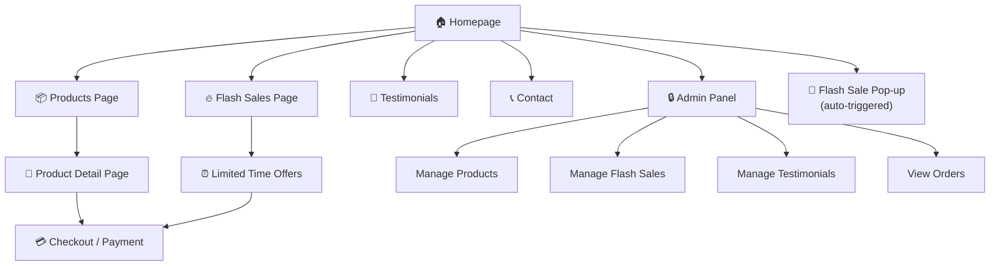

# NovaHub — Client Meeting Analysis & Website Approach

> **Client:** Shiv (UK-based, 2nd year BCS Cyber Security student)
> **Developer:** Sayanth (You — MCA student, working with 2-3 friends)
> **Meeting Date:** Jul 23, 2026 | **Duration:** ~24 minutes
> **Budget Discussed:** ₹30,000+ | **Payment:** Split payments agreed (₹10,000 on demo → rest after)

---

## 1. Deep Analysis of Client Requirements

### 1.1 Core Business Model
Shiv resells **AI tool subscriptions** (Gemini, ChatGPT, Lovable, Google AI, etc.) at **deeply discounted prices**. He claims to source these through Jio affiliation partnerships. This is essentially a **digital product resale / subscription marketplace**.

### 1.2 Extracted Feature Requirements

| # | Feature | Priority | Complexity | Notes from Transcript |
|---|---------|----------|------------|----------------------|
| 1 | **Product Listing Pages** | 🔴 Critical | Medium | List all AI tools/subscriptions with pricing |
| 2 | **Payment Gateway Integration** | 🔴 Critical | High | Users must be able to pay online for subscriptions |
| 3 | **Flash Sale / Offers Page** | 🟡 High | Medium | Dedicated page showing discounted products (e.g., Lovable at 20% off, ₹1000 → ₹800) |
| 4 | **Flash Sale Pop-up** | 🟡 High | Low-Medium | On-site pop-up for time-limited offers ("20% off — Get Lovable NOW!") |
| 5 | **Payment Proof / Trust Section** | 🟡 High | Low | Screenshots of past payments, delivery proofs to build trust |
| 6 | **Testimonials Section** | 🟡 High | Low | Customer reviews and social proof |
| 7 | **Admin Panel (Headless CMS)** | 🔴 Critical | High | Shiv needs to manage products, prices, offers, and proofs himself |
| 8 | **Referral / Coupon System** | 🟢 Nice-to-have | Medium | Mentioned briefly — "track that code and refer" |

### 1.3 What You (Sayanth) Committed To

| Commitment | Details |
|---|---|
| **Phase 1 — Demo (UI/UX)** | Frontend-only demo in **2-3 days** showing the full interface and design |
| **Phase 2 — Full Build** | Backend, payment integration, admin panel — starts **after client confirms the demo** |
| **Pricing** | More than ₹30,000 (final TBD after discussing with team) |
| **Payment Terms** | Split payment accepted (₹10,000 on demo delivery, rest in installments) |
| **Next Step** | Send WhatsApp list of required assets (logo in HD, brand colors, etc.) |
| **Follow-up** | Meet again in 1-2 days; messaging in between for doubts |

### 1.4 Things Shiv Will Provide
- High-definition **logo**
- Product details and pricing
- Flash sale content and percentages
- Payment proofs / screenshots
- Any other brand assets

---

## 2. Red Flags & Risk Assessment

> [!WARNING]
> ### Business Legitimacy Concerns
> Shiv claims to resell premium AI subscriptions at "almost zero" cost through Jio affiliation. This business model is **highly questionable**:
> - No legitimate "Jio affiliation" program publicly offers Gemini/ChatGPT at near-zero prices
> - This could be a **grey-market resale** operation (stolen credentials, shared accounts, educational license abuse, etc.)
> - You mentioned in the call that you encountered scams in this space
>
> **Your Risk:** Building a professional website for a potentially illegitimate business could damage your reputation. Proceed with caution — make sure you're building a **generic SaaS subscription marketplace** and not complicit in anything questionable.

> [!IMPORTANT]
> ### Pricing Concerns
> - ₹30,000+ for a full-stack application with payment integration, admin panel, flash sales, and pop-ups is **very low**
> - The client mentioned ₹10,000 and ₹15,000 splits — this could be ₹25,000 total or more, clarify
> - Factor in: your team's time (2-3 people), payment gateway integration complexity, ongoing maintenance
> - **Recommendation:** Finalize exact pricing BEFORE starting the demo

---

## 3. Recommended Website Approach

### 3.1 Tech Stack

```
┌─────────────────────────────────────────────────┐
│                  TECH STACK                      │
├─────────────────────────────────────────────────┤
│  Frontend:   Next.js 14+ (App Router)           │
│  Styling:    Tailwind CSS v4 + Framer Motion     │
│  Backend:    Next.js API Routes / Server Actions │
│  Database:   Supabase (PostgreSQL + Auth + RLS)  │
│  Payments:   Razorpay (India-focused, easy KYC)  │
│  CMS/Admin:  Custom admin dashboard              │
│  Hosting:    Vercel (frontend) + Supabase (DB)   │
│  SEO/GEO:    Built-in Next.js metadata API       │
└─────────────────────────────────────────────────┘
```

**Why this stack:**
- **Next.js** — SSR/SSG for SEO + GEO optimization (you pitched this), fast, full-stack
- **Supabase** — Free tier is generous; handles auth, DB, storage without separate backend
- **Razorpay** — Indian payment gateway, easy integration, supports UPI/cards/wallets
- **Vercel** — Free tier hosting, instant deploys, perfect for Next.js

### 3.2 Site Architecture



### 3.3 Page-by-Page Breakdown

#### 🏠 Homepage
- Hero section with animated headline and CTA
- Featured products carousel
- Trust badges (payment proofs section)
- "Why Choose Us" with key differentiators
- Flash sale banner (if active)
- Testimonials slider
- Footer with contact & social links

#### 📦 Products Page
- Grid layout of all AI tools/subscriptions
- Filter by category (AI Assistants, Design Tools, etc.)
- Each card: tool logo, name, original price, discounted price, "Buy Now" CTA
- Sort by price, popularity, discount %

#### 🔥 Flash Sales Page
- Countdown timer for each active deal
- Before/after pricing with discount percentage
- "Limited stock" urgency indicators
- Direct checkout button per deal

#### 📄 Product Detail Page
- Full description of the subscription
- What's included (features list)
- Pricing tiers (if applicable: monthly, yearly)
- Payment proof specific to that product
- Related products
- FAQ accordion

#### 💳 Checkout Flow
- Cart summary
- Razorpay payment modal
- Order confirmation page
- Email/WhatsApp notification to Shiv on new order

#### 💬 Testimonials / Trust Page
- Grid of payment proof screenshots (uploaded by admin)
- Customer testimonials with names/ratings
- "Verified Purchase" badges
- Stats counter (X+ happy customers, Y+ subscriptions sold)

#### 🔒 Admin Dashboard
- **Products CRUD** — Add/edit/delete products, set prices, upload images
- **Flash Sales Manager** — Create sales with start/end dates, discount %, auto-expire
- **Testimonials Manager** — Upload payment proofs, add customer testimonials
- **Orders View** — See incoming orders, payment status
- **Pop-up Manager** — Toggle flash sale pop-up on/off, customize message

---

## 4. Phased Execution Plan

### Phase 1 — Demo (2-3 Days) ⏳

> [!TIP]
> This is what you committed to. **Frontend only** — no backend, no payment integration. Focus on making the UI stunning enough to lock in the client.

| Day | Deliverables |
|-----|-------------|
| **Day 1** | Homepage + Products page + Flash Sale page (fully designed, responsive) |
| **Day 2** | Product detail page + Checkout mock + Pop-up component + Testimonials section |
| **Day 3** | Polish animations, mobile responsiveness, deploy to Vercel for live demo link |

**Demo should include:**
- All pages navigable with realistic dummy data
- Flash sale pop-up working on homepage
- Mobile responsive
- Dark/modern theme matching AI tools branding
- Placeholder products (Gemini, ChatGPT, Lovable, etc.)

---

### Phase 2 — Full Build (After Approval, ~7-10 Days)

| Week | Deliverables |
|------|-------------|
| **Week 1** | Supabase setup → DB schema → Auth → Admin panel CRUD → Products & flash sales management |
| **Week 2** | Razorpay integration → Checkout flow → Order tracking → Pop-up management → SEO/GEO optimization → Final testing |

---

## 5. Before You Start — Action Items

### Send to Client (WhatsApp Checklist)

```
Hi Shiv, here's what I need to get started on the demo:

1. ✅ Logo (high resolution PNG/SVG)
2. ✅ Brand colors (if any preference)
3. ✅ List of all products/services with prices
4. ✅ Any specific design references you like
5. ✅ Payment proof screenshots (for testimonials section)
6. ✅ Any existing social media links
7. ✅ Preferred domain name (if purchased)
8. ✅ Contact details for the website (email, phone, WhatsApp)
```

### Internal Team Discussion Points
- [ ] Finalize exact pricing (₹30K seems too low for full-stack + payment + admin)
- [ ] Decide roles — who handles frontend, who handles backend, who handles deployment
- [ ] Set up project repo and development environment
- [ ] Discuss payment terms — milestone-based is safest
- [ ] Consider a simple contract/agreement (even informal) to protect yourselves

---

## 6. Recommended Payment Structure

| Milestone | Amount | Trigger |
|-----------|--------|---------|
| **Demo Delivery** | ₹10,000 | When live demo link is shared |
| **Admin Panel + Backend** | ₹10,000 | When admin panel is functional |
| **Payment Integration + Launch** | ₹10,000-15,000 | When site goes live with payments |
| **SEO/GEO Optimization** | ₹5,000 (optional add-on) | Post-launch optimization |

> **Total: ₹35,000 - ₹40,000** (recommend this range given the scope)

---

## 7. Key Decisions to Make Before Coding

1. **Payment Gateway:** Razorpay vs Cashfree vs PhonePe Business? (Razorpay recommended)
2. **Domain & Hosting:** Who buys the domain? Client or you? (Client should own it)
3. **Admin Access:** Will Shiv manage the site himself? Needs to be simple enough for a non-technical user
4. **Maintenance Contract:** Will you support post-launch? Monthly retainer?
5. **Content:** Who writes the product descriptions? You or Shiv?
